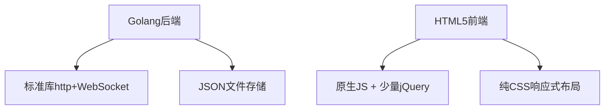

**核心功能+轻量化+稳定易用**的EasilyPanel5 我的世界开服面板

---

### **精简核心功能清单**
#### **1. 基础服务器管理**
- ✅ **一键开服**：自动检测系统Java环境，支持上传自定义核心（JAR文件）
- ✅ **实例启停**：支持启动/停止/重启操作
- ✅ **实例信息**：查看服务器版本/状态/在线人数
- ✅ **FastMirror下载核心** 通过FastMirror API下载核心 并一键创建实例
- ✅ **MCSL-Sync下载核心** 通过MCSL-Sync API下载核心 并一键创建实例
- ✅ **实时控制台**：WebSocket交互 + 基础ANSI色彩支持（重要错误信息标红）
- ✅ **配置文件编辑**：常用配置可视化编辑（`server.properties`/`spigot.yml`）

#### **2. 进程守护（必须稳定！）**
- ✅ **崩溃重启**：自动检测进程退出，3秒内重启服务
- ✅ **资源限制**：设置内存上限（避免吃满宿主内存）
- ✅ **自启管理**：系统重启后自动恢复服务器

#### **3. OpenFRP 整合**
- ✅ **隧道创建**：输入OpenFRP密钥 → 自动获取节点列表 → 创建Minecraft隧道
- ✅ **状态监控**：实时显示隧道流量/在线状态
- ✅ **日志查看**：穿透服务的连接日志（快速排查问题）
- ✅ **隧道自动配置** 隧道自动适配服务器端口

#### **4. 实用小工具**
- ✅ **计划任务**：定时重启/备份（cron语法简化版）
- ✅ **玩家管理**：查看在线玩家 + 发送公告（无需进游戏）通过Minecraft Ping协议
- ✅ **性能图表**：CPU/内存占用趋势图（过去1小时）

#### **5.实例管理**
- ✅ **实例创建**：支持创建多个实例，每个实例可独立管理
- ✅ **实例列表**：查看所有实例的简要信息
- ✅ **实例切换**：在不同实例之间快速切换
- ✅ **实例删除**：删除不再使用的实例

#### **2FA登陆**
- ✅ **2FA认证**：开启2FA认证，提高安全性
- ✅ **简单注册**：扫码绑定，直接使用

---

### **技术栈精简化**

---

### **为什么这样设计？**
1. **开发效率**：
   - 用原生JS代替Vue/React，减少构建流程
   - 无需数据库，无需配置MySQL
2. **零依赖部署**：
   - 最终编译为单个二进制文件 + 前端静态资源
   - 运行时无需安装Node/Python等环境
3. **稳定性关键点**：
   - 进程守护用`os/exec` + `sync.Mutex`避免并发冲突
   - OpenFRP调用官方API（不重复造轮子）
4. **用户体验**：
   - 控制台自动滚动（可打断并恢复自动滚动）
   - 手机适配：左侧菜单折叠 + 大按钮设计

---

### **功能优先级排序**
| 功能               | 必要性 | 开发量 | 首版实现 |
|--------------------|--------|--------|----------|
| 服务器启停/控制台  | ★★★★★  | 中     | ✅        |
| 进程守护           | ★★★★★  | 高     | ✅        |
| OpenFRP基础整合    | ★★★★☆  | 中     | ✅        |
| 配置文件编辑       | ★★★☆☆  | 低     | ✅        |
| 计划任务           | ★★★☆☆  | 中     | V1.1     |

---
